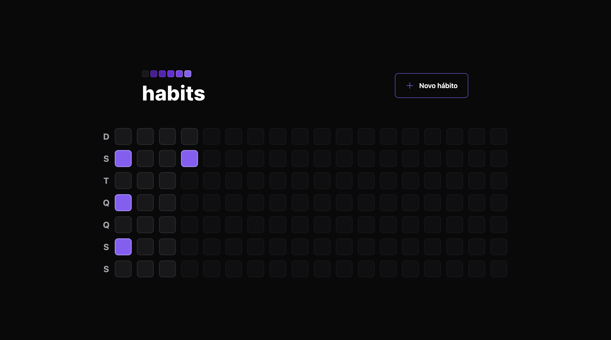
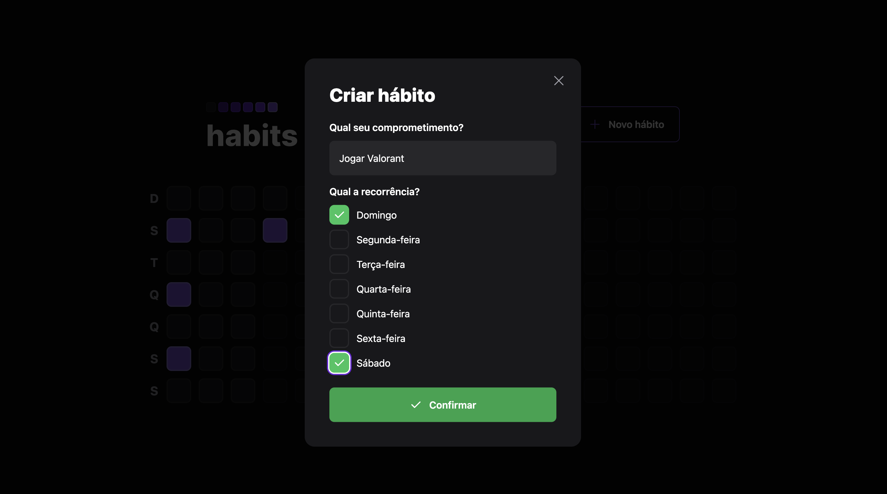
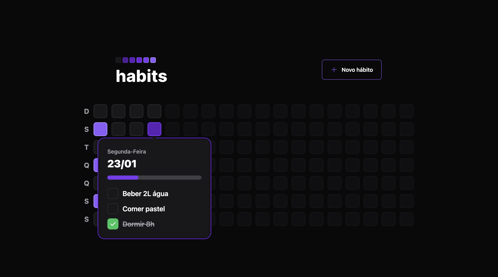
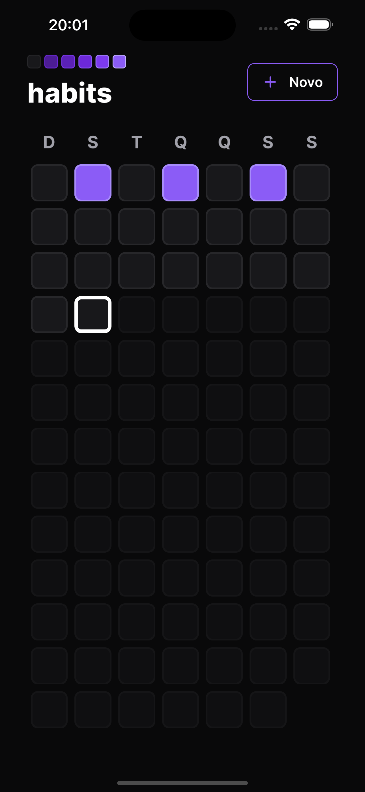
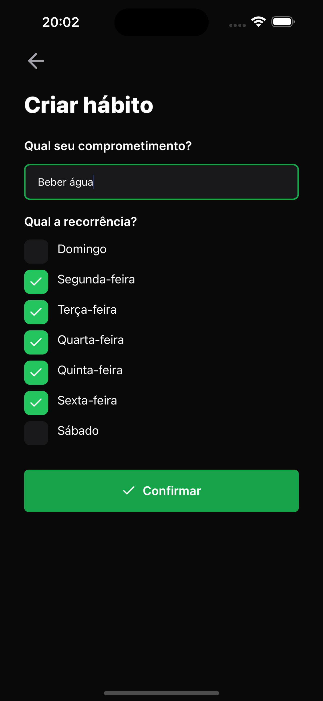
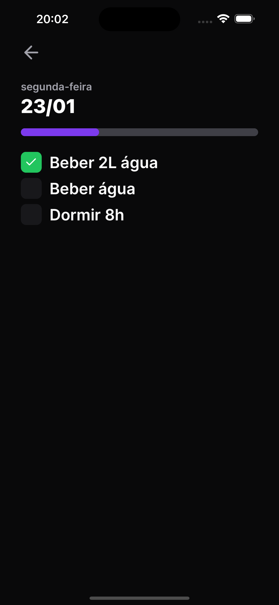

  <h1 align="center">
   
  
   
   
</h1>

 

<h2 align="center">Habit tracker for you to track your daily habits :)</h2>

 

  

 

# :camera: **Screenshots**

### :computer: Web

  
  
  

### :iphone: Mobile

  
  
  

 

 

## :suspect: **Techs**

 

### **This app was developed using:**

 

#### **Web app:**
- ⚙️ **Vite**
- 📝 **Typescript**
- ⚛️ **ReactJS**
- 🎨 **TailwindCSS**
- 🎨 **RadixUI**

#### **Mobile app:**
- ⚛️ **React Native**
- ⚛️ **Expo**
- ⚙️ **React Navigation**
- 🤹‍♂️ **React Native Reanimated**
- 🎨 **Nativewind/TailwindCSS**

#### **API:**
- 🗂️ **SQLite**
- 🐯 **Fastify**
- 🔷 **Prisma**
- 🔒 **Zod**

 

## :godmode: **Run this project**

1. Clone this repo `git clone https://github.com/israelfagundes/habit-tracker.git`
2. On the project's root folder, run `make install` to install all dependencies

### :suspect: **API**

1. Inside `server` folder, rename `.env.sample` file to `.env`
2. On the project's root folder, run `make up_server` to start server on `https://localhost:3333`

### :suspect: **Web Client**

1. Inside `web` folder, rename `.env.sample` file to `.env`
2. Inside `.env` file, fill `API_URL` variable with your API url.
3. On the project's root folder, run `make up_web` to start web client on `https://localhost:5173`

### :suspect: **Mobile Client**

1. Inside `mobile` folder, rename `.env.sample` file to `.env`
2. Inside `.env` file, fill `API_URL` variable with your API url (must use the IP address instead of localhost).
3. On the project's root folder, run `make up_mobile` to start metro bundler.
4. Alternatively, you can run `make up_android` to run android emulator, or `make up_ios` to run xcode simulator (if you already have xcode properly installed and set up).

 
 
 
 
 
 

###### :feelsgood: Made with :hearts: and :droplet: (tears) :feelsgood:
